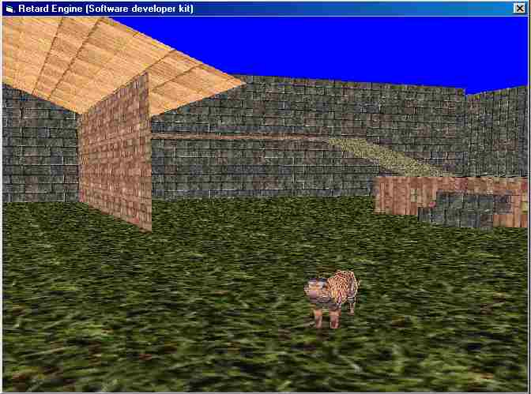



## A 3D Retar\_ Engine with SDK

### Description

Sorry for downloading problems. This code contains 3D engine with collision detection, bullet flight system, meshes and other very nice features. Code is very simple with a lot of comments and help file. If you like it, vote for me, so I can create advanced version for you.
 
### More Info
 

             |
---                |---
**Submitted On**   |2001-08-11 13:45:08
**By**             |[Milan Satala](https://github.com/Planet-Source-Code/PSCIndex/blob/master/ByAuthor/milan-satala.md)
**Level**          |Intermediate
**User Rating**    |4.8 (190 globes from 40 users)
**Compatibility**  |VB 5\.0, VB 6\.0
**Category**       |[DirectX](https://github.com/Planet-Source-Code/PSCIndex/blob/master/ByCategory/directx__1-44.md)
**World**          |[Visual Basic](https://github.com/Planet-Source-Code/PSCIndex/blob/master/ByWorld/visual-basic.md)
**Archive File**   |[A 3D Retar244568112001\.zip](https://github.com/Planet-Source-Code/milan-satala-a-3d-retar-engine-with-sdk__1-26097/archive/master.zip)

